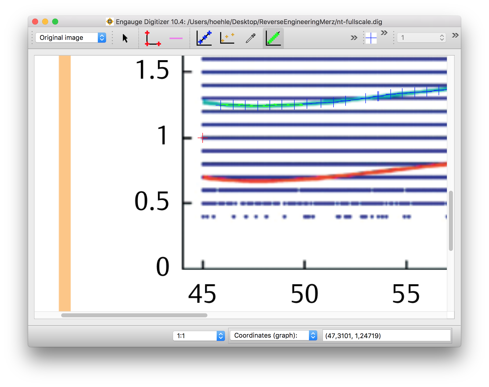
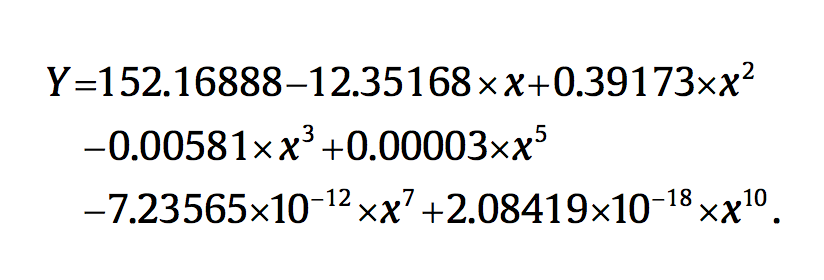

```{r setup, include=FALSE, warning=FALSE, message=FALSE}
knitr::opts_chunk$set(echo = FALSE, fig.width = 8, fig.height= 4)
require(knitr)
require(dplyr)
require(magrittr)
require(ggplot2)
require(kableExtra)

##This might require an install from github
##devtools::install_github("hoehleatsu/trisomy21risk")
require(trisomy21risk)
```

## Abstract

This supplementary material contains the two appendix for the blog post [*Retracing Prenatal Testing Algorithms*](http://math.su.se/~hoehle/blog/2018/06/pcr.html), which contains an implementation of the @merz_etal2016 method for the risk calculation for Down syndrome based on combined first trimester testing. Appendix 1 contains a detailed description of how the likelihood ratio is computed based on the concept of "degree of extremeness" of an observation. We exemplify this by showing the computations for the NT measurement. Appendix 2 contains an account of our difficulties to reproduce the NT curve given in Fig. 3 of the paper.

<br>
<a rel="license" href="http://creativecommons.org/licenses/by-sa/4.0/"></a>
This work is licensed under a <a rel="license"
href="http://creativecommons.org/licenses/by-sa/4.0/">Creative Commons
Attribution-ShareAlike 4.0 International License</a>.
The markdown+Rknitr source code of this blog is available under a [GNU
General Public License (GPL
v3)](https://www.gnu.org/licenses/gpl-3.0.html) license from github.
The specific source file of this appendix is `_drafts/fts-appendix.Rmd`.
<a name="appendix1"></a>

## Appendix 1 - Computing the Likelihood Ratios

For each biomarker the likelihood ratio between the euploid and uneuploid population is in @merz_etal2016, after a possible suitable transformation,  computed as a ratio between two Gaussian densities. To this end @merz_etal2008 introduced the concept of "degree of extremeness" (DoE) of an observation.

### The degree of extremeness of an observation

 Let $x$ denote the crown-rump-length (CRL) of a fetus and let $y$ denote the measured biomarker value, say, NT. The DoE is then defined as
$$
\operatorname{DoE}(y) = \left\{
\begin{array}{ll}
\displaystyle{\frac{y-\hat{y}(x)}{y^*(x) - \hat{y}(x)}} & \text{if } y \geq \hat{y}(x) \\
\displaystyle{-\frac{\hat{y}(x)-y}{\hat{y}(x) - y_*(x)}} & \text{if } y < \hat{y}(x)
\end{array}
\right.
,
$$
where $\hat{y}(x)$ is the predicted value (i.e. the conditional expectation) in a polynomial regression model regressing NT on CRL and $y^*(x)$ and $y_*(x)$ are the so called reference bands from the regression model. These are obtained by subtracting a value $\sigma_*$ from $\hat{y}(x)$ and adding a value $\sigma^*$ to $\hat{y}(x)$ in order to get the 5% and 95% quantiles of the distribution, respectively. Note that this means that the distribution of NT does not have to be symmetric around the mean, but since $\sigma_*$ and $\sigma^*$ are fixed values, the quantiles are assumed to be parallel over the whole range of CRL. There are thus similarities with quantile regression based on a generalized model for location, scale and shape (GAMLSS), which would have been an alternative approach towards the problem and without the discontinuity the $y\leq \hat{y}(x)$ condition gives [@fenske_etal2008]. Since we were unable to obtain any kind of reasonable curve with the 10th order polynomial specified in the upper right column of p. 22 of @merz_etal2016 (see Appendix 2), we instead inverse graphed the curve from the Fig. 3 of the article using the open-source [Engauge Digitizer](https://markummitchell.github.io/engauge-digitizer/) program.

<center>

</center>

When fitting a 10th order polynomial to the digitized points using least-squares we obtain the following functional form for $\hat{y}(x)$, where $x$ is the CRL (measured in mm).

```{r, echo=TRUE}
nt_ls <- function(crl) {
  (86.8495636412728*1) + (-6.45603285194204*crl) + (0.178676863518831*crl^2) + (-0.0019492362713131*crl^3) + (1.25983144232195e-07*crl^5) + (-6.84398153615137e-12*crl^7) + (1.53020537087493e-18*crl^10)
}
```
The functional form can also be illustrated graphically to see how the NT develops with gestational age. Since no data are available to us we can not investigate the uncertainty in the estimated curve, however, polynomials are know to suffer from severe edge effects. A penalized spline might have been a more prudent choice here.

```{r, echo=FALSE, fig.align="center"}
df <- data.frame(crl =  seq(45, 85, length=1000)) %>%
  mutate(nt= nt_ls(crl))
ggplot(df, aes(x=crl, y=nt)) + geom_line() + xlab("CRL (mm)") + ylab("NT (mm)")
```


For the calculation of the likelihood ratio it is assumed that the DoEs have an approximate Gaussian distribution with mean and standard deviation depending on a fetus' ploidy. Reversing the $DoE(y)$ formula while treating all values besides $y$ as fixed, yields


$$
y = \left\{
\begin{array}{ll}
DOE \cdot (y^*(x) - \hat{y}(x)) + \hat{y}(x) & \text{if } y \geq \hat{y}(x) \\
DOE \cdot (\hat{y}(x) - y_*(x)) + \hat{y}(x) & \text{if } y < \hat{y}(x)
\end{array}
\right.
$$
where $DOE \sim N(\mu, \sigma^2)$ with mean and variance depending on the ploidy. For NT, an additional $\sqrt[7]{DOE+2.5}$ transformation to normality is performed, i.e. $\sqrt[7]{DOE+2.5} \sim N(\mu, \sigma^2)$. In @merz_etal2016 the parameters of these two Gaussian distributions are estimated from data and stated to be
$$
\begin{align*}
\mu_{\text{eu}} = 1.13263 && \sigma_{\text{eu}} = 0.04320 \\
\mu_{\text{aneu}} = 1.23730 && \sigma_{\text{aneu}} = 0.09251 \\
\end{align*}
$$
In other words, higher NT values are indicative of T21. Unfortunately, the @merz_etal2016 paper only shows the raw NT data for the $n = 186,215$ euploid pregnancies (Fig. 3) so it's hard to assess how adequate these distributional assumption for the T21 aneuploid population is. In @merz_etal2011 a T21 population of $n=500$ fetus is mentioned, but not graphed. Looking at Fig. 9 of @FMF2004 or Fig. 1 of @kagan_etal2008a it becomes obvious that the distinction between the two populations based on NT measurements is limited to the range of 40-75 mm crown-rump-length. The larger the fetus is at the scan (i.e. the later it is scanned), the less clear cut the distinction between the two populations appears and the greater the uncertainty of any statement will - also because of the smaller number of measurements at CRLs of 80-85 mm. This is not reflected by the above formulas, but without the T21 data it is hard to assess, if this is also a problem for the analysis in @merz_etal2016.

Altogether, the likelihood ratio for a NT measurement of 2.3 mm at a CRL of 57.7 mm of is computed as follows:

```{r, echo=TRUE}
## Bandwidths, see Merz et al. (2016) paper
nt_qBands <-      c(-0.57159, 0.65869)

## Gestational age. Although not said Tab. 5 in Merz et al. (2016) is measured
## in weeks, but the graph & formula expect the crl to be in mm.
## We take the conversion formula from http://journals.sagepub.com/doi/pdf/10.1179/174313409X448543
##
## Gestational age = (CRL x 1.037)^0.5 x 8.052 + 23.73
crl <- gestage2crl(86)

##Measurement, predictions and lower/upper band
y <- c(nt=2.3)
y_pred <- c(nt=nt_ls(crl))
y_ref <- c(y_pred + nt_qBands[1], y_pred + nt_qBands[2])

##Compute degree of extremeness for the NT measurement
(doe_nt <- doe( y, y_pred, y_ref[1], y_ref[2]))

##NT values from Table 3 of Merz et al. (2016)
eu   <- c(mean=1.13263, sd=0.0432)
aneu <- c(mean=1.23730, sd=0.09251)

##Compute likelihood ratios - values from Merz et al. (2016)
(lr_nt <- lr( (doe_nt + 2.5)^(1/7), eu=eu,  aneu=aneu))
```
In other words, the observed NT value is indicative for T21, because $\operatorname{LR}_{\text{NT}}>1$. If NT would be the only biomarker measured it would take one from an prior odds of $1:145$ to a posterior odds of $1:(`r sprintf("%.2f", 1/lr_nt)`\cdot 145)=1:`r sprintf("%.0f", 145/lr_nt)`$.

In the above computation `lr` is a function to compute the ratio between two Gaussian densities:
```{r, echo=TRUE}
# Likelihood ratio between two univariate normals
#
# @param x measured value
# @param eu eucaryte (i.e. value in non-diseased population)
# @param aneu anormal eucaryte (i.e. value in diseased population)
# @return dnorm(x, mean=aneu[1], sd=aneu[2]) / dnorm(x, mean=eu[1], sd=eu[2])

lr <- function(x, eu, aneu) {
  eu[2] / aneu[2] * exp(-0.5*((x-aneu[1])/aneu[2])^2 + 0.5*((x-eu[1])/eu[2])^2)
}
```

As an alternative to the pure quantitative risk calculation, the DoE for each of the three observed biomarkers can also be visualized. From the above formula we use the transformation of probabilities theorem to derive the distribution of $y$ in the euploid an aneuploid population, respectively. These densities are then plotted against each other. Note the discontinuity at an observed NT value of $y = \hat{y}(x)=`r sprintf("%.1f",y_pred)`$ mm.

```{r, fig.align="center"}
##The transformation functions. Identity if not transformed.
f <- function(x) {
  doe_inv(x^7-2.5, y_pred=y_pred, ref_lower=y_ref[1], ref_upper=y_ref[2])
}

f_inv <- function(y) {
  (doe(y, y_pred=y_pred, ref_lower=y_ref[1], ref_upper=y_ref[2]) + 2.5)^(1/7)
}

diff_f_inv <- function(y) {
  ref_lower <- y_ref[1] ; ref_upper <- y_ref[2]
  r <- ifelse(y>y_pred,
              1 / (ref_upper - y_pred),
              1 / (y_pred - ref_lower)
  )
  1/(7 * (doe(y, y_pred=y_pred, ref_lower=y_ref[1], ref_upper=y_ref[2])+2.5)^(6/7)) * r
}

res21 <- list( y=y, y_pred=y_pred, y_lower=y_ref[1], y_upper=y_ref[2], doe_list=list(doe_nt), lr_list=list(nt=lr_nt))
p <- plotLR("nt", "NT", "NT [mm]", eu=eu, aneu=aneu, res21=res21, f=f, f_inv=f_inv, diff_f_inv=diff_f_inv)
p
```

From the figure we see that the density of the euploid population at the observed value of `r sprintf("%.1f mm", y)` is `r sprintf("%.3f",lr_nt)` times more likely than for the uneuploid population. In other words, the observed NT value provides evidence towards the fetus not having T21.

<a name="appendix2"></a>

## Appendix 2 - The NT Polynomial stated in @merz_etal2016

The polynomial formula described in @merz_etal2016 as characterising "the dependence of the mean of that variable on gestational age as expressed in terms of CRL" is given in the top right-hand column of p. E22:

<center>

</center>

However, using $x$ as CRL (measured in mm) provides no way near results corresponding to what is shown in Fig. 3 of the paper (we even checked against accidentally flipped signs).

```{r}
##Digitized data from Fig. 3 of the paper
nt_graph <- read.table("nt-fullscale.tsv", dec=",",header=TRUE)

##This is the NT function as stated in the Merz et al. (2016)
nt_merz <- function(x) {
  152.16888 - 12.35168*x + 0.39173*x^2 - 0.00581*x^3 + 0.00003*x^5 - 7.23565e-12*x^7 + 2.08419e-18*x^10
}

##A data.frame containing all +/-1 on the last digits of the Merz et
##al. (2015) paper
coef_grid <- expand.grid(c(152.16887,152.16888,152.16889),
                    c(-12.35167,-12.35168,-12.35169),
                    c(0.39172,0.39173,0.39174),
                    c(-0.00580,-0.00581,-0.00582),
                    c(0.00002,0.00003,0.00004),
                    c(-7.23564e-12,-7.23565e-12,-7.23566e-12),
                    c(2.08418e-18,2.08419e-18,2.08420e-18))

##Polynomial of 10th order with 7 coeffs not zero
nt_coef <- function(x, coef) {
  coef[1] + coef[2]*x + coef[3]*x^2 + coef[4]*x^3 + coef[5]*x^5 + coef[6]*x^7 + coef[7]*x^10
}

y <- apply(coef_grid, 1, function(coef) nt_coef(nt_graph$x, coef))
yrange <- t(apply(y, 1, range))
colnames(yrange) <- c("lower","upper")
nt_graph <- cbind(nt_graph, yrange) %>% mutate(nt_merz= nt_merz(x))

nt_graph_long <- tidyr::gather(nt_graph, key="type", value="y", -x)

p1 <- ggplot(nt_graph, aes(x=x, y=Curve1)) + geom_line() + coord_cartesian(ylim=c(0,5)) + ylab("NT [mm]") + xlab("CRL-US [mm]") + ggtitle("NT polynomial in Fig. 3", subtitle=" ")

poly_df <- with(nt_graph, data.frame(x=c(x,rev(x)),y=c(lower, rev(upper))))

p2 <- ggplot(nt_graph, aes(x=x, y=nt_merz)) + ylab("NT [mm]") + xlab("CRL-US [mm]") + geom_polygon(data=poly_df, aes(x=x, y=y), fill="darkgray") + geom_line() + ggtitle("NT polynomial formula in paper", subtitle="(incl. sensitivity analysis for last digit)")

gridExtra::grid.arrange(p1, p2, ncol=2)
```

We first suspected this discrepancy due to reported polynomial being rounded to five "significant digits - see e.g. the $x^5$ term of the polynomial - and contacted the authors about this. The reply was that further digits could not be provided, because a commercial software company holds the rights to the algorithm. Based on this answer we conducted a sensitivity analysis trying the smallest and largest possible value still yielding the same reported significant digits of the polynomial. The bands in the right hand figure show the smallest and largest possible value, which could be due to rounding. Based on this figure it becomes clear that rounding is not the problem. Either

1. some sort of transformation (e.g. between gestational age in weeks and CRL in mm) or
2. a, later in the paper described 7th-square-root transformation
3. or some other non-documented transformation

is additionally applied to $x$ or $y$. We contacted the authors again with this finding asking them about which of the above applies, but unfortunately they either lacked the time to reply or chose not to reply. At least we never heard back... From a **scientific point of view** we found the
 excuse of a third-party-copyright-holder preventing transparency of the algorithm very disappointing. As a consequence, we inverse graphed the polynomial from Fig. 3 and became motivated to write a ShinyAapp reproducing the computations, because algorithms on such sensitive matters should be **transparent** and **reproducible**!


## References
